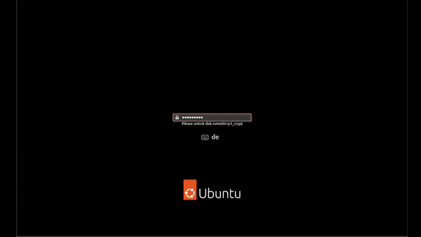

# plymouth-theme-hot-dog



modified plymouth hot-dog theme, merged with the spinner theme to look more like the default Ubuntu theme.

## Installation

To install on Ubuntu run the following commands:

``` bash
$ sudo cp -r hot-dog /usr/share/plymouth/themes/
$ sudo update-alternatives --install /usr/share/plymouth/themes/default.plymouth default.plymouth /usr/share/plymouth/themes/hot-dog/hot-dog.plymouth 100
$ sudo update-alternatives --config default.plymouth # choose the hot-dog theme with the number
$ sudo update-initramfs -u
```

You can test the look of the theme by running `sudo ./plymouth-test.sh`. This will run the theme for 20 seconds before closing it and dropping you back into your Desktop.
